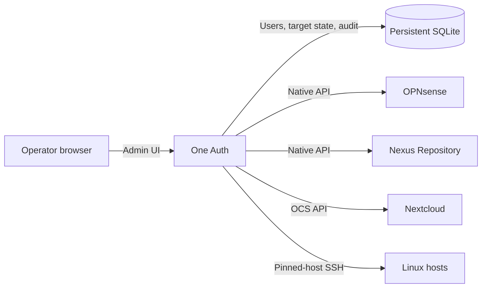

# One Auth (Non-SSO)

One place to manage local identities across OPNsense, Nexus Repository,
Nextcloud, and SSH—without introducing an identity provider or changing how
those systems authenticate.

One Auth gives operators a focused administrative console for creating and
maintaining local accounts across any number of configured targets. Each
operation is sent through the target's native user-management interface and
tracked independently, so a partial outage stays visible and recoverable.

## Identity operations without SSO

- Create, update, disable, delete, restore, and explicitly purge managed users.
- Assign each non-root account to exactly the targets it needs.
- Propagate usernames, display names, email addresses, passwords, and SSH
  public keys where supported.
- See per-user, per-target state with live pending and retry updates.
- Recover automatically with persistent capped exponential backoff, or retry
  an individual target immediately.
- Keep an audit trail of administrative actions and connector results.

## Security by design

- The protected recovery account remains local-only and cannot be assigned to
  external targets.
- Plaintext managed-user passwords are never persisted.
- Short-lived propagation secrets and target management credentials are
  encrypted using `ONEAUTH_SECRET_KEY`.
- Target credentials are write-only in the UI and must pass an immediate probe
  before synchronization is enabled.
- SSH host keys are pinned, and only managed-user public keys persist.
- Local deletion is recoverable until an operator deliberately purges it.

## Built for heterogeneous local accounts

One Auth currently includes connectors for:

- OPNsense Auth User API
- Nexus Repository Security API
- Nextcloud OCS Provisioning API
- Debian, Ubuntu, RHEL, and Rocky Linux over pinned-host SSH

Each target instance has a stable identity, independent health and credential
state, and its own configured default groups or roles.

## How it fits

Targets keep authenticating their users locally. One Auth coordinates those
accounts; it does not sit in the login path and does not become an SSO
dependency.

## See it or deploy it

Try the complete application against protocol-faithful mock APIs and isolated
OpenSSH targets:

**[Run the demo](docs/DEMO.md)**

Prepare configuration, target permissions, backups, and normal operations:

**[Production guide](docs/PRODUCTION.md)**

Understand the implementation, synchronization model, and engineering workflow:

**[Developer guide](docs/DEVELOPER.md)**

One Auth is intentionally not SSO. It is a practical control plane for
environments where important systems still own local users and those accounts
must remain consistent, observable, and recoverable.
