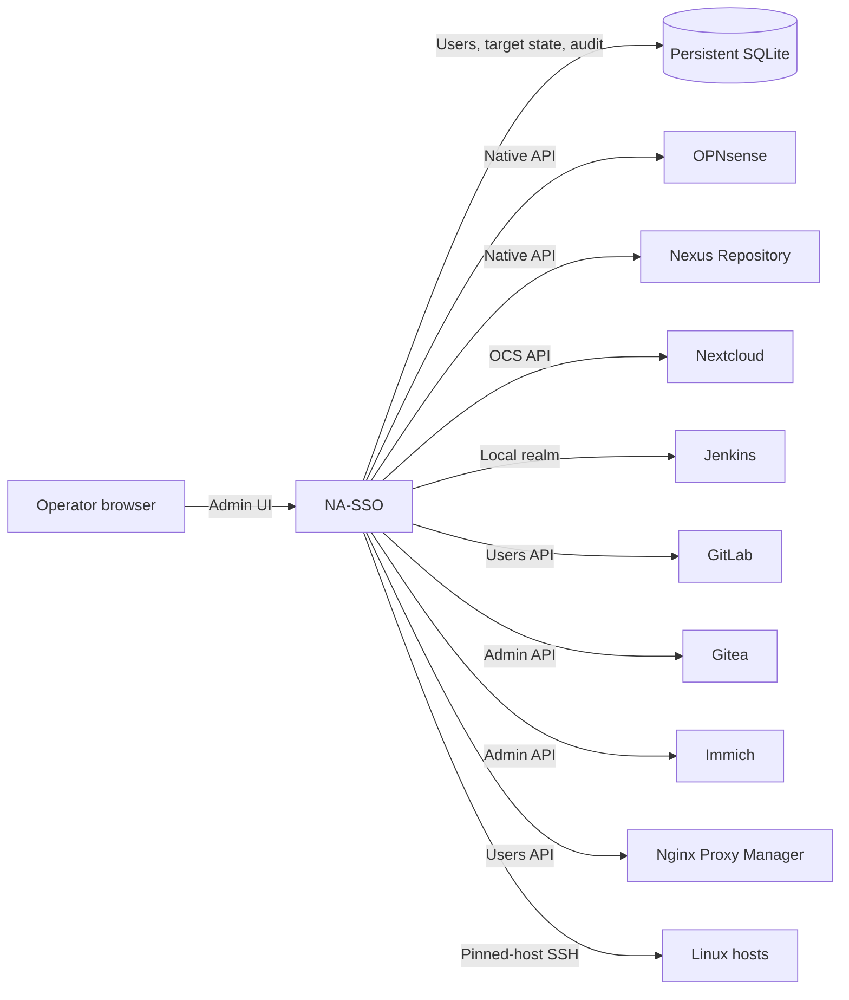

# NA-SSO

**Not Another SSO.**

One place to manage local identities across OPNsense, Nexus Repository,
Nextcloud, Jenkins, GitLab, Gitea, Immich, Nginx Proxy Manager, and SSH—without
introducing an identity provider or changing how those systems authenticate.

NA-SSO gives operators a focused administrative console for creating and
maintaining local accounts across any number of configured targets. Each
operation is sent through the target's native user-management interface and
tracked independently, so a partial outage stays visible and recoverable.

## Identity operations without SSO

- Create, update, disable, delete, restore, and explicitly purge managed users.
- Assign each non-root account to exactly the targets it needs.
- Propagate usernames, display names, email addresses, passwords, and SSH
  public keys where supported.
- See per-user, per-target state with live pending and retry updates.
- Recover automatically with persistent capped exponential backoff, or retry
  an individual target immediately.
- Keep an audit trail of administrative actions and connector results.
- Compare desired assignments, profile, status, groups/roles, and SSH key
  fingerprints with read-only target state, then explicitly approve repair.
- Manage separate named SSH keys per device with add-before-revoke rotation,
  expiry, individual revocation, and password-confirmed emergency removal.
- Let assigned users download their own OpenVPN client configuration from an
  OPNsense target — bundled with an OPNsense-issued client certificate when the
  server requires certificate plus password — and revoke it on offboarding
  through the certificate authority's revocation list.
- Reuse immutable assignment-profile versions while preserving visible
  per-user target and membership exceptions.
- Preview and replay-safe execute CSV/API onboarding and offboarding with
  downloadable partial outcomes.
- Record account ownership and purpose, schedule temporary-access transitions,
  and run attested access reviews with reminders.
- Automate bounded user, target-health, operation, reconciliation, bulk, and
  audit workflows through a versioned, rate-limited, idempotent API.
- Use scoped, expiring, independently revocable service-account credentials and
  `na-ssoctl` for scripted preview/apply/status/export workflows.
- Discover target-local accounts without mutation, then explicitly adopt,
  persistently ignore, or Root-approve a guarded one-use removal.

## Security by design

- The protected recovery account remains local-only and cannot be assigned to
  external targets.
- Plaintext managed-user passwords are never persisted.
- Initial, administrator-reset, and restore passwords are temporary local
  credentials. Assigned target accounts remain uncreated or disabled in
  `CHPW` until the user signs in and chooses a replacement password.
- Short-lived propagation secrets and target management credentials are
  encrypted using `NA_SSO_SECRET_KEY`.
- Password-expiry dates are visible to administrators and to users on their
  account page; an expired user may replace the password or explicitly accept
  the risk of keeping it.
- Target credentials are write-only in the UI and must pass an immediate probe
  before synchronization is enabled.
- SSH host keys are pinned, and only managed-user public keys persist.
- Local deletion is recoverable until an operator deliberately purges it.

## Built for heterogeneous local accounts

NA-SSO currently includes connectors for:

- OPNsense Auth User API
- Nexus Repository Security API
- Nextcloud OCS Provisioning API
- Jenkins built-in local security realm
- GitLab Self-Managed Users API
- Gitea administrator Users API
- Immich administrator Users API
- Nginx Proxy Manager v2.15.1 Users API
- Debian, Ubuntu, RHEL, and Rocky Linux over pinned-host SSH

Each target instance has a stable identity, independent health and credential
state, and configured default groups or roles where the target supports them.
Jenkins local-realm accounts support create, read, and delete; Jenkins core has
no realm-independent disable operation, so NA-SSO fails that action safely.
Nginx Proxy Manager supports profile, password, disable, discovery, and delete
operations, but not exact role/group or SSH-key management.

## How it fits

Targets keep authenticating their users locally. NA-SSO coordinates those
accounts; it does not sit in the login path and does not become an SSO
dependency.

## Who it's for

If you run a handful of self-hosted systems that each keep their **own** local
accounts — a firewall, a couple of Git servers, a CI server, an artifact
repository, file sync, photos, a reverse proxy, some Linux boxes — you already
know the tax: onboarding means logging into eight admin panels, offboarding is a
checklist you hope you finished, and nobody can say with confidence who has
access to what. Standing up a full identity provider and rewiring every system's
login is more than you want. NA-SSO is the middle path: one console that keeps
those local accounts consistent, observable, and recoverable, without touching
how anyone signs in.

## Guides

Start where you fit:

| You are… | Read |
| --- | --- |
| **Evaluating it** | [Demo guide](docs/DEMO.md) — the whole app against protocol-faithful mock APIs and isolated OpenSSH targets, no real systems touched. |
| **Deploying it** | [Build & deployment guide](docs/PRODUCTION.md) — build, secrets, target permissions, TLS/ingress, MFA, notifications, backups. |
| **Operating it** | [Administrator guide](docs/ADMIN.md) — targets, users, CHPW, reconciliation, imports, access reviews, audit, and automation. |
| **A managed user** | [User guide](docs/USER.md) — sign-in, taking over your password, SSH keys, and OpenVPN. |
| **Extending it** | [Connector contract](docs/CONNECTORS.md) — add a target against the versioned capability and conformance rules. |
| **Hacking on it** | [Developer guide](docs/DEVELOPER.md) — internals, the synchronization model, and the engineering workflow. |

NA-SSO is intentionally not SSO. It is a practical control plane for
environments where important systems still own local users and those accounts
must remain consistent, observable, and recoverable.

## License

Released under the [MIT License](LICENSE). Third-party dependencies are fetched
at install time and remain under their own licenses — see
[THIRD_PARTY_NOTICES.md](THIRD_PARTY_NOTICES.md).
