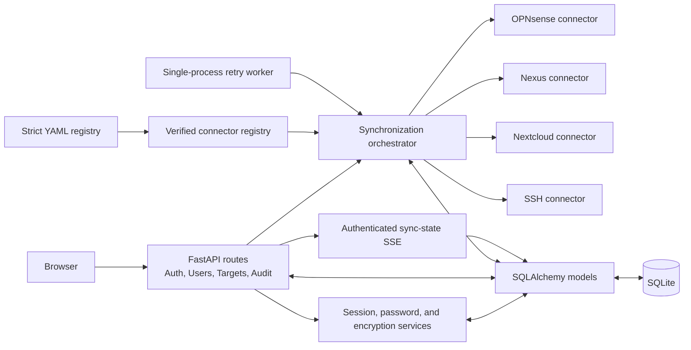
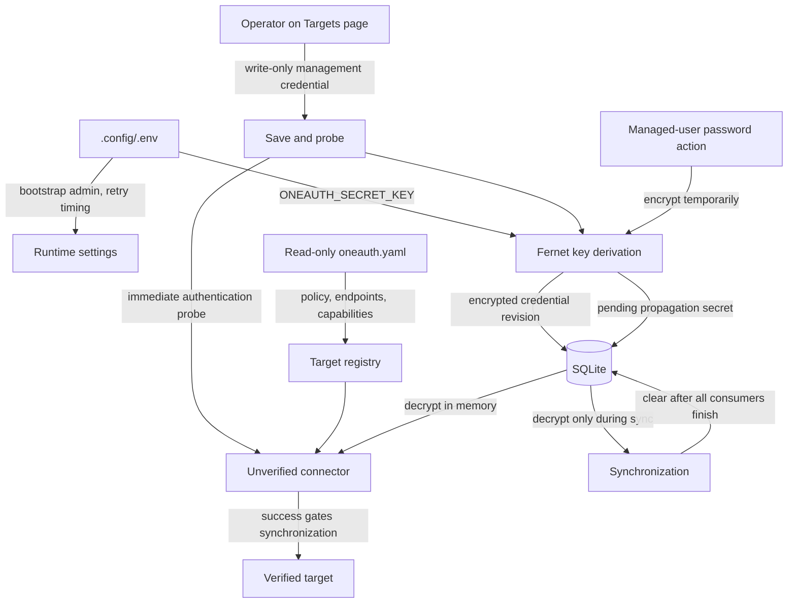
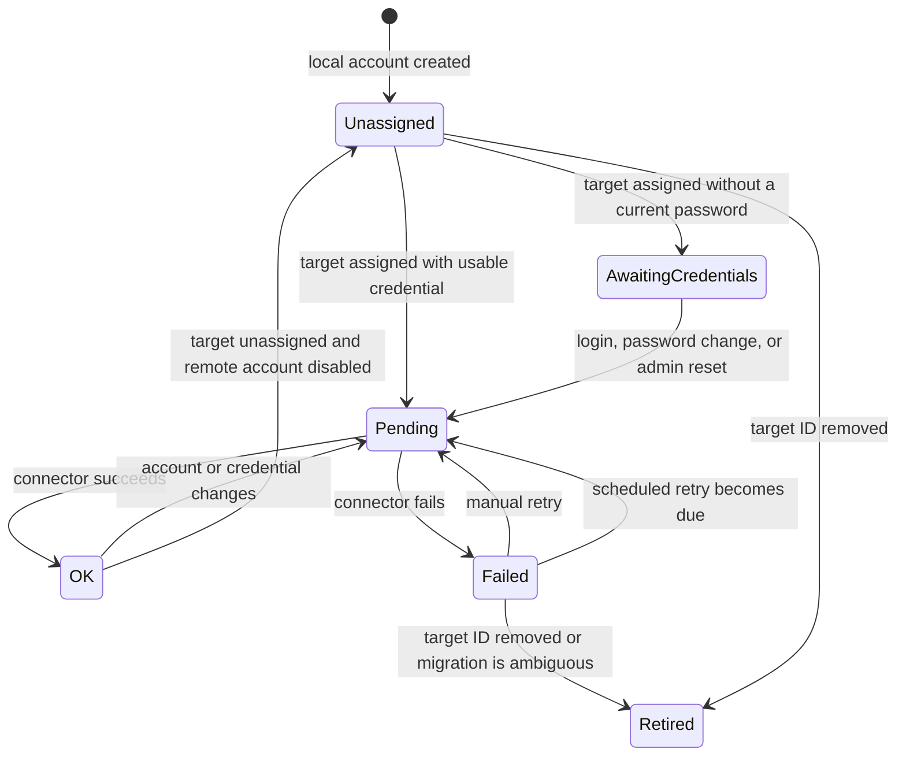
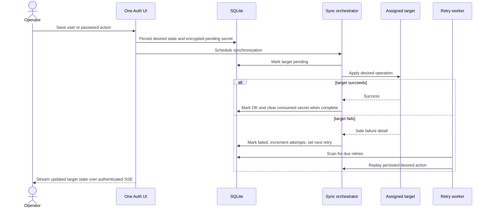

# Developer guide

This guide covers One Auth internals, local engineering setup, synchronization
behavior, and verification. Deployment and operator procedures belong in the
[production guide](PRODUCTION.md); evaluation workflows belong in the
[demo guide](DEMO.md).

## Local setup

Python 3.12 or newer is required:

```sh
python -m venv .venv
.venv/bin/pip install -e '.[dev]'
.venv/bin/pytest -q
```

The application can run directly with a valid local `.config/.env` and
`.config/oneauth.yaml`, but Compose should be used for container lifecycle and
for the complete demo. Follow the nearest `AGENTS.md` before editing any path.

## Code map

| Area | Start here | Responsibility |
| --- | --- | --- |
| Application startup | `oneauth/main.py` | Lifespan, database initialization, retry worker, routes, and static mounts. |
| Configuration | `oneauth/config.py` | Strict YAML models, environment references, policies, and target registry. |
| Persistence | `oneauth/models.py` | Managed users, sync state, encrypted target credentials, and audit events. |
| Authentication | `oneauth/auth.py` | Sessions, login, password actions, and SSH enrollment. |
| User lifecycle | `oneauth/users.py` | Create, edit, assign, disable, delete, restore, purge, and manual retry. |
| Synchronization | `oneauth/sync.py` | Fan-out, encrypted pending secrets, retry scheduling, and recovery worker. |
| Target onboarding | `oneauth/target_credentials.py` | Encrypted credential revisions, readiness, and probe gating. |
| Connectors | `oneauth/connectors/` | Target-specific API and pinned-host SSH adapters. |
| Templates | `oneauth/templates/` | Administrative UI and authenticated live state updates. |
| Behavioral tests | `tests/` | Configuration, security, connector, lifecycle, and demo coverage. |

## Application architecture



The HTTP application and retry worker share one process and one SQLite
database. Scaling to multiple workers requires a distributed lock and durable
external queue; duplicating the current process would duplicate recovery work.

## Configuration and secret flow



YAML credentials may reference exact `${ENV_NAME}` values, but the normal UI
path stores encrypted credential revisions in SQLite. Plaintext managed-user
passwords exist only for the current request or as encrypted pending secrets
while assigned targets still need them.

## Synchronization state model



Stable target IDs key sync history. Removed targets and ambiguous legacy
migrations remain retired for operator visibility rather than being discarded.
`awaiting_credentials` is intentionally not retried until a verified login or
password action supplies a new short-lived credential.

## Synchronization sequence



Connector methods return `SyncResult` instead of leaking transport exceptions.
Each attempt persists safe detail, attempt count, and the next retry time before
the UI receives the updated state.

## Connector contracts

Every connector implements idempotent `ensure_user`, `disable_user`,
`delete_user`, and `probe` operations. Target IDs and capabilities come from
the strict registry; encrypted database credentials are hydrated only when a
connector is constructed.

HTTP connectors use bounded timeouts. SSH connectors pin the configured host
fingerprint, use non-interactive constrained operations, append supplementary
groups without removing unrelated memberships, and persist only managed-user
public keys.

Endpoint or payload changes require verification against official target
documentation or source plus mocked-response tests.

## Verification

Run the full behavioral suite after application changes:

```sh
.venv/bin/pytest -q
```

Focused areas are documented by the nearest DOX file. Common checks include:

```sh
.venv/bin/pytest -q tests/test_connectors.py
.venv/bin/pytest -q tests/test_mock_targets.py
./compose-helper.sh --profile build config --quiet
./compose-helper.sh demo-compose --profile build config --quiet
```

Tests use temporary SQLite databases, mocked HTTP responses, or loopback mock
servers and do not contact real targets by default. Container-affecting changes
also require an image build and bounded log inspection through
`compose-helper.sh`.
