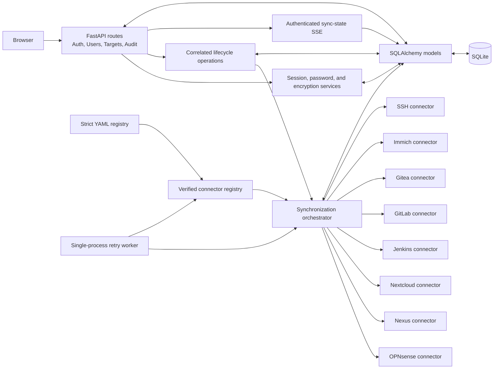
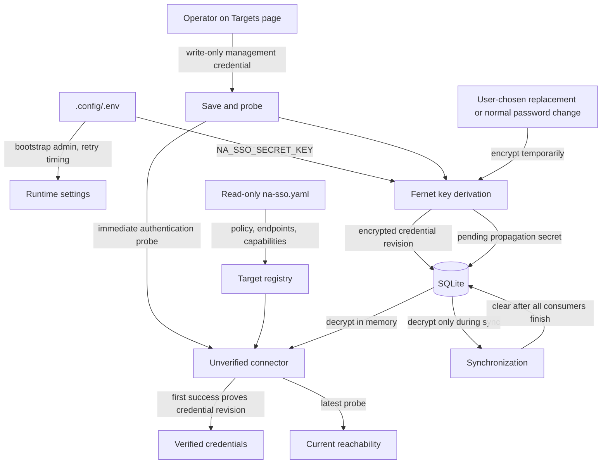
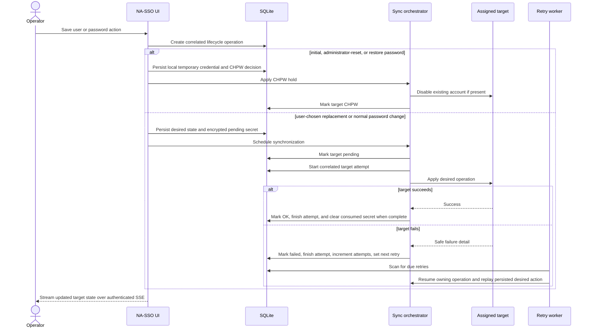

# Developer guide

This guide covers NA-SSO internals, local engineering setup, synchronization
behavior, and verification. Deployment and operator procedures belong in the
[production guide](PRODUCTION.md); evaluation workflows belong in the
[demo guide](DEMO.md).

## Local setup

Python 3.12 or newer is required:

```sh
python -m venv .venv
.venv/bin/pip install -e '.[dev]'
.venv/bin/pytest -q
```

The application can run directly with a valid local `.config/.env` and
`.config/na-sso.yaml`, but Compose should be used for container lifecycle and
for the complete demo. Follow the nearest `AGENTS.md` before editing any path.

## Code map

| Area | Start here | Responsibility |
| --- | --- | --- |
| Application startup | `na_sso/main.py` | Lifespan, database initialization, retry/retention/notification/reconciliation/governance workers, routes, and static mounts. |
| Configuration | `na_sso/config.py` | Strict YAML models, environment references, policies, and target registry. |
| Lifecycle contract | `na_sso/lifecycle.py` | Typed commands, states, conflicts, terminal checks, and UI presentation. |
| Persistence | `na_sso/models.py` | Managed users, correlated operations/attempts, sync state, encrypted target credentials/TOTP, public WebAuthn credentials, retention-governed audit events, and webhook delivery state. |
| Authentication | `na_sso/auth.py`, `na_sso/request_security.py` | Same-origin request boundary, hardened sessions/headers, login, password actions, scoped permission gates, administrator MFA/recovery, and SSH enrollment. |
| SSH key lifecycle | `na_sso/ssh_keys.py` | Named public keys, validation, add-before-revoke rotation, revocation, expiry, and audited synchronization. |
| User lifecycle | `na_sso/users.py` | Create, edit, assign, disable, delete, restore, purge, and manual retry. |
| Automation API | `na_sso/api.py` | Versioned capability discovery and user/target/operation/reconciliation/audit resources over shared domain services. |
| API contract | `na_sso/api_contract.py` | JSON auth/permission errors, request IDs, rate limiting, pagination metadata, and durable actor-bound idempotency. |
| Service accounts | `na_sso/service_accounts.py` | Root-managed capability scopes, expiring keyed-hash Bearer credentials, overlap rotation, revocation, and last-use metadata. |
| CLI | `na_sso/cli.py` | Scriptable bulk/reconciliation preview/apply, operation status, target/user listing, and audit export over API v1. |
| Assignment policy | `na_sso/assignments.py` | Immutable profile versions, preview/publish/apply workflow, explicit exceptions, and effective target/membership resolution. |
| Bulk workflows | `na_sso/bulk.py` | Bounded CSV/JSON preview and idempotent execution, correlated row outcomes, exports, and one-time temporary credentials. |
| Reconciliation | `na_sso/reconciliation.py`, `na_sso/reconcile.py` | Sanitized target snapshots, drift classification, reports, approval-bound repair, and scheduled preview runs. |
| Unmanaged accounts | `na_sso/unmanaged.py` | Read-only target enumeration, exclusions, durable dispositions, no-mutation adoption, and guarded one-use removal. |
| Access governance | `na_sso/governance.py` | Effective-date/inactivity policy, automation worker, access review drafts, reviewer attestations, and reminders. |
| UI feedback | `na_sso/feedback.py` | Signed one-time mutation outcomes and safe template rendering across redirects. |
| Operations | `na_sso/operations.py` | Durable operation creation, conflict handling, progress, target attempts, and completion. |
| Notifications | `na_sso/notifications.py` | Redacted event enqueue, signed webhook delivery/retry, and root destination controls. |
| Synchronization | `na_sso/sync.py` | Serialized fan-out, operation correlation, encrypted pending secrets, retry scheduling, and recovery worker. |
| Target onboarding | `na_sso/target_credentials.py` | Encrypted credential revisions, credential proof, current reachability, sanitized probe history, and connection retry. |
| Connectors | `na_sso/connectors/` | Target-specific API and pinned-host SSH adapters. |
| Templates | `na_sso/templates/` | Administrative UI and authenticated live state updates. |
| Behavioral tests | `tests/` | Configuration, security, connector, lifecycle, and demo coverage. |

Named SSH credentials live in `user_ssh_keys`; the legacy
`managed_users.ssh_public_key` column is only a compatibility mirror. The SSH
connector always writes the complete active key set, including an empty file
after final-key revocation, and reconciliation compares exact desired/observed
fingerprint sets. Current SSH management access does not expose authentication
logs, so per-key last use is intentionally reported as unsupported.

Connector extensions follow the versioned [connector contract](CONNECTORS.md).
The target API publishes inspection, discovery, dry-run, membership,
key-last-use, timeout, and error capabilities so clients do not guess from type.

## Application architecture



The HTTP application and retry worker share one process and one SQLite
database. Lifecycle requests are serialized per user in that process and
persist a parent operation plus one record for each target attempt. Scaling to
multiple workers still requires a distributed lock and durable external queue;
duplicating the current process would duplicate recovery work.

## Configuration and secret flow



YAML credentials may reference exact `${ENV_NAME}` values, but the normal UI
path stores encrypted credential revisions in SQLite. Plaintext managed-user
passwords exist only for the current request or as encrypted pending secrets
while assigned targets still need them. Initial, administrator-reset, and
restore passwords are local-only temporary credentials and never enter this
propagation flow. Only the replacement selected by the user is staged for
targets.

Each database credential revision is write-only and must pass an immediate
probe before propagation can use it. The stored readiness model keeps that
credential proof separate from the latest reachability result, along with the
revision, credential update time, last check, last success, sanitized detail,
and capped automatic retry. An authentication failure revokes credential proof;
a later network outage preserves the prior proof while reporting the target as
currently unreachable.

## Synchronization state model

```mermaid
stateDiagram-v2
    [*] --> Unassigned: local account created
    Unassigned --> CHPW: target assigned while initial/reset decision is required
    CHPW --> Pending: user chooses replacement password
    OK --> CHPW: administrator resets password; remote account is disabled
    Unassigned --> AwaitingCredentials: target assigned without a current password
    AwaitingCredentials --> Pending: verified login or user password change
    Pending --> OK: connector succeeds
    Pending --> Failed: connector fails
    Pending --> Unsupported: connector declares the request unsatisfiable
    Failed --> Pending: operation-owned manual retry
    Failed --> Pending: operation-owned scheduled retry becomes due
    Unsupported --> Pending: later account change or delete re-attempts
    OK --> Pending: account or credential changes
    OK --> Unassigned: target unassigned and remote account disabled
    Failed --> Retired: target ID removed or migration is ambiguous
    Unassigned --> Retired: target ID removed
    CHPW --> Pending: delete overrides password hold
    AwaitingCredentials --> Pending: delete overrides credential wait
    Retired --> Pending: delete preserves historical target scope
    Pending --> OK: remote deletion succeeds
```



Stable target IDs key sync history. Removed targets and ambiguous legacy
migrations remain retired for operator visibility rather than being discarded.
`chpw` means an initial, administrator-reset, or restore password decision is
outstanding. The temporary password stays local; a new remote account is not
created, and an existing remote account is disabled. When the user chooses a
replacement, that credential is staged and synchronization moves to `pending`.

`awaiting_credentials` is distinct: it is intentionally not retried until a
verified login or a user password action supplies a new short-lived credential.
An administrator reset moves the account to `chpw`; it does not supply a target
credential.

`unsupported` records a connector validation failure — the target declared the
requested operation unsatisfiable (for example, Jenkins core cannot disable a
local-realm account). It is terminal, counts as a failed target and an inventory
issue, notifies immediately as a persistent failure, and is never scheduled for
automatic retry; a later account change, delete, or reassignment re-attempts it.
Ordinary failures — including a failed offboarding disable on an already
unassigned target — keep scheduled retries until the target reaches the
requested state, and are presented as failures rather than masked by the
unassigned label.

`lifecycle.py` owns every persisted command/status/state value and its UI
presentation. The Users page and authenticated SSE therefore render the same
labels, descriptions, retry eligibility, and terminal meaning. A delete can
start from every state and supersedes unfinished non-delete work; update and
restore requests are rejected while conflicting work runs. Restore and purge
are available only after remote deletion reaches its terminal result.

## Synchronization sequence



Connector methods return `SyncResult` instead of leaking transport exceptions.
Each request has a durable operation ID shared by its target attempts, sync
states, and audit events. Attempts persist safe detail, attempt count, and the
next retry time before the UI receives updated operation progress, failed and
blocking target IDs, and canonical state presentation. Destructive recovery is
offered only after terminal remote deletion. No operation record stores a
password or pending secret.

Password expiry is derived from `password_changed_at` and the configured
`expires_after_days`. Initial/reset accounts show expiry as **after CHPW**;
after the user chooses a replacement, the exact date is shown in both the admin
Users table and the personal account page. Expired users must change the
password unless `expiry_acknowledgement_mode` permits a full-cycle `renewal` or
a shorter `grace`. The decision page calculates the resulting date before
confirmation and enforces the per-password acknowledgement limit. Keeping a
password records `password_keep_until` and `password_keep_count` without
changing the evidentiary `password_changed_at`; a real password change clears
both acknowledgement fields.

### User inventory and access presentation

`inventory.py` owns bounded query parameters and the SQL-backed people view:
search, lifecycle/target/issue filters, stable sorting, 25/50/100-row pages,
target coverage, and issue summaries. The Users page renders that contract as a
desktop table or narrow-screen cards; canonical per-target state remains on the
dedicated user detail page.

Bulk assignment/onboarding, unassignment/offboarding, disable, and retry always
render a no-mutation preview. Confirmation accepts at most 100 deduplicated IDs,
creates one parent `bulk` operation for correlation and partial outcome detail,
and uses the preview UUID as an idempotency key. Replaying it returns the stored
result without changing users or adding audit events.

`bulk.py` extends that contract to CSV and JSON onboarding/offboarding jobs of
up to 1,000 rows. It stores the normalized preview, binds idempotency to the
authenticated actor, and records a parent operation with per-row children.
Generated temporary passwords remain encrypted until a single audited POST
download, then are erased; export fields are neutralized against spreadsheet
formula execution.

`assignments.py` owns immutable, versioned profiles and the effective assignment
resolver consumed by synchronization and reconciliation. Publishing and
applying are separate preview/confirmation boundaries. Direct assignments are
not discarded when a profile is applied: they become visible include
exceptions, and target or membership include/exclude exceptions are resolved
after the profile.

`reconciliation.py` defines sanitized connector observations and exact-versus-
required membership comparison. `reconcile.py` persists bounded runs and
findings, issues actor-bound one-use approvals, creates correlated repair
operations, and schedules report-only scans with retry/backoff. Connectors may
return `unknown` or `unsupported`; absence of evidence is never treated as
evidence that destructive repair is safe.

`governance.py` stores lifecycle policy separately from account state, then a
single-process worker activates due accounts, applies confirmed end actions,
and opens deduplicated inactivity reviews. Reviews are drafts until explicitly
opened and retain the owner/reason snapshot used for attestation. Retain,
disable, and delete decisions are audited; delete has a second confirmation.
Reminder events use the normal redacted notification pipeline.

### Automation API contract

`api.py` is an adapter over the existing inventory, target readiness,
operation, reconciliation, bulk, and audit services. It must not implement a
second lifecycle model. `api_contract.py` turns browser-session authentication
and central permissions into JSON outcomes, enforces a bounded per-principal
request window, and stores mutation responses under an actor/method/path/key
fingerprint. Validation and HTTP failures beneath `/api/v1` use the same
versioned error envelope; HTML routes retain their existing behavior.

List responses carry stable page metadata and respect
`automation_api_policy.max_page_size`. API serializers explicitly allowlist
fields: never serialize ORM objects directly, target definitions with addresses
or credentials, password/key material, pending secrets, or unredacted operation
and connector detail. A target probe is a `target_probe` lifecycle operation;
bulk and reconciliation continue to use their existing parent/child operation
records. OpenAPI is generated from the FastAPI models at `/openapi.json` and
rendered interactively at `/docs`.

`service_accounts.py` authenticates only the `nas_<prefix>_<random>` Bearer
format. The random value is HMAC-SHA256 hashed with a domain-separated key
derived from `NA_SSO_SECRET_KEY`; plaintext exists only in the issuance
response. Authentication rejects expired/revoked credentials and expired or
revoked parent accounts before constructing a principal. Its explicit
capability set is consumed by `api_guard`; it never receives browser session,
MFA, or `security.manage` authority. Last use is updated at most every five
minutes to avoid turning each read into a write.

`cli.py` is installed as `na-ssoctl` through `project.scripts`. It is a thin
HTTP client: file parsing and output formatting are local, but validation,
authorization, idempotency, previews, approval, execution, and status all
remain server-owned. Keep CLI output automation-safe and never include the
Bearer token in transport errors.

The personal Account page derives **My access** from assigned sync state and
non-secret target definitions. It shows canonical user-facing state, supported
credential mode, retry time, SSH fingerprint, and `support_policy`; it omits
connector detail, management addresses, and target credentials.

### Scoped administration

`permissions.py` is the single role-to-capability map. Route modules call the
shared permission guard before loading or mutating protected resources; Jinja
receives the derived permission context only to render matching controls and
the workflow-ordered sidebar. The shared shell keeps administrative destinations
in that icon-bearing collapsible/off-canvas sidebar and reserves the account
menu for **My account** and **Sign out**; password and MFA controls live on the
account page. User operators can mutate ordinary `user` accounts only. Target
operators own target configuration and probes. Auditors own investigation and
export. Root owns all capabilities plus role assignment, while model invariants
keep ID 0 active, local-only, and `root`. Any new administrative route must add
an explicit capability check and a bypass test in `test_permissions.py`.

`mfa.py` adds a password-first gate only for roles with administrative
capabilities. A short-lived signed pending cookie binds WebAuthn/TOTP/recovery
verification to the account and session version; the full session records MFA
completion and the password-authentication time. Required operators without a
factor receive a restricted session that can reach enrolment but permission
guards redirect every administrative route back to MFA. Registration and
authentication challenges are short-lived signed HttpOnly cookies. WebAuthn
verifies RP ID, exact origin, challenge, user presence, and user verification;
TOTP accepts a narrow clock window and persists the last counter to block
replay. MFA tests mock only cryptographic WebAuthn verification while exercising
real options, cookies, storage, scopes, TOTP, and recovery behavior.

`notifications.py` owns both event enqueue and delivery. Producers provide only
the allowlisted actor, subject, operation, target, and outcome fields plus a
stable dedupe key; they never pass connector detail. One delivery row is
created per active subscribed endpoint. The worker reconstructs endpoint
secrets from strict YAML, signs the exact stored JSON body, does not follow
redirects, and records a safe HTTP status or exception class for retry. Runtime
disable state is separate from immutable configuration. New notification event
sources must add a stable dedupe contract and tests proving the payload cannot
carry source detail or secrets.

## Connector contracts

Every connector implements idempotent `ensure_user`, `disable_user`,
`delete_user`, and `probe` operations. Target IDs and capabilities come from
the strict registry; encrypted database credentials are hydrated only when a
connector is constructed.

HTTP connectors use bounded timeouts. SSH connectors pin the configured host
fingerprint, use non-interactive constrained operations, append supplementary
groups without removing unrelated memberships, and persist only managed-user
public keys.

Endpoint or payload changes require verification against official target
documentation or source plus mocked-response tests.

## Verification

Run the full behavioral suite after application changes:

```sh
.venv/bin/ruff check na_sso tests
.venv/bin/pytest -q
```

Focused areas are documented by the nearest DOX file. Common checks include:

```sh
.venv/bin/pytest -q tests/test_connectors.py
.venv/bin/pytest -q tests/test_mock_targets.py
./compose-helper.sh --profile build config --quiet
./compose-helper.sh demo-compose --profile build config --quiet
```

Tests use temporary SQLite databases, mocked HTTP responses, or loopback mock
servers and do not contact real targets by default. Container-affecting changes
also require an image build and bounded log inspection through
`compose-helper.sh`.
