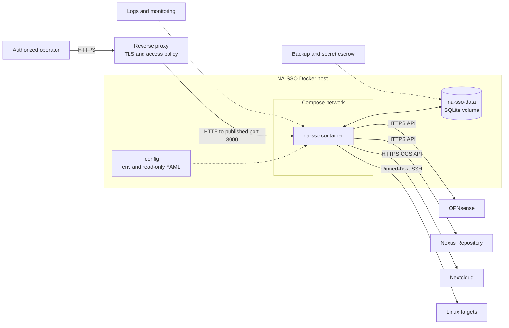

# Production guide

This guide covers the normal, demo-free Compose model in
`docker-compose.yaml`. The file is production-focused, but a production rollout
still requires deployment-managed secrets, immutable image distribution,
ingress/TLS, monitoring, backups, and environment-specific hardening.

`compose-helper.sh` is designed for local administration and explicitly is not
a complete production orchestrator. Review its behavior before using it in an
automated or privileged environment.

For internal architecture, synchronization state, and local engineering setup,
see the [developer guide](DEVELOPER.md).

## Reference architecture

The supplied normal Compose model runs one application process with persistent
SQLite storage. TLS termination, access policy, monitoring, and backup
automation sit outside the repository-provided stack.



The reverse proxy is deliberately outside the supplied Compose stack. Only the
The NA-SSO container runs on its Compose network; SQLite is a mounted volume, not
a separate database container. Each target remains an independent outbound
destination. Managed users continue signing in directly to those targets—NA-SSO
is not in their authentication path.

## Configuration ownership

The normal runtime uses exactly two ignored local files:

| Host file | Container use | Contents |
| --- | --- | --- |
| `.config/.env` | Loaded into `na-sso` | Bootstrap admin, encryption key, database path, and retry timing. |
| `.config/na-sso.yaml` | Mounted read-only at `/config/na-sso.yaml` | Password/SSH policy and non-secret target definitions. |

Create them from the fully annotated templates:

```sh
cp .config/.env.example .config/.env
cp .config/na-sso.yaml.example .config/na-sso.yaml
```

Replace every placeholder before starting. Compose sets
`NA_SSO_CONFIG_FILE=/config/na-sso.yaml`; do not override it in `.config/.env`.

The templates show every supported setting, constraint, target type, and
optional environment-backed credential field. Normally, management credentials
should instead be entered through **Targets**, where they are encrypted in
SQLite and never rendered back.

The password policy's `expires_after_days` value controls managed-account
expiry. Use an integer from 1 through 3650, or `null` to disable expiry. The
calculated date is shown in the administrator's **Users** table and on the
user's **Account** page.

The YAML registry is intended to remain non-secret. Environment-backed YAML
credential fields exist for deployment automation, but UI-managed credentials
are the preferred path for this Compose deployment.

## Bootstrap and recovery settings

| Variable | Purpose |
| --- | --- |
| `NA_SSO_SECRET_KEY` | Signs sessions and encrypts pending secrets and target credentials. Generate a long random value, keep it stable, and back it up. |
| `NA_SSO_ADMIN_USERNAME` | Username created when the database has no administrator. |
| `NA_SSO_ADMIN_BOOTSTRAP_PASSWORD` | Initial password used only for bootstrap; changing it does not rotate an existing account. |
| `NA_SSO_DATABASE_PATH` | SQLite location; `/data/na-sso.db` uses the persistent Compose volume. |
| `NA_SSO_RETRY_SCAN_SECONDS` | Recovery-worker scan frequency; default `5`. |
| `NA_SSO_RETRY_BASE_SECONDS` | First automatic retry delay; default `5`. |
| `NA_SSO_RETRY_MAX_SECONDS` | Exponential-backoff ceiling; default `300`. |

The protected root recovery account is local-only. It cannot be assigned,
disabled, deleted, demoted, or expired into remote operations.

## Target registry

Every target in `.config/na-sso.yaml` needs a stable unique `id`. IDs are
database identities, not display labels: renaming one retires the old target
history rather than transparently moving it. Repeated target types are allowed.

Keep HTTP target URLs at the server root with no trailing API path. Keep TLS
verification enabled in production. A target's `default_groups` or
`default_roles` must already exist; synchronization fails rather than silently
provisioning an account without the intended memberships.

In **Targets**, save and probe credentials for every enabled target before
assigning users. Until the current credential revision passes, that target
cannot be assigned, synchronized, or retried.

### OPNsense

Create a dedicated local API account with permission to search, create, update,
and delete users through the Auth User API. Generate an API key and secret. The
connector sends `name`, description, email, disabled state, configured group
memberships, and password when required.

Use group identifiers expected by the installed Auth User API version.

### Nexus Repository

Use a dedicated local service account that can read, create, update, and delete
users and change local-user passwords. Relevant privileges include:

- `nexus:users:read`
- `nexus:users:create`
- `nexus:users:update`
- `nexus:users:delete`

Current Nexus source protects the change-password endpoint with `nexus:*`.
Verify the least-privilege role against the exact deployed version. Replace the
example `nx-anonymous` default role with the access intended for managed users.

### Nextcloud

Ensure the OCS Provisioning API app is enabled. Use a dedicated administrator
and preferably an app password. The connector uses Basic authentication and
sends `OCS-APIRequest: true` on every request.

Every configured default group must already exist.

### SSH

Supported platforms are Debian, Ubuntu, RHEL, and Rocky Linux. Pin the exact
SHA-256 host fingerprint and create every configured supplementary group before
probing the target.

The SSH administrator needs the documented user-management commands plus
access to `getent group` and passwordless sudo for `usermod -aG`. NA-SSO
appends configured groups without removing unrelated memberships.

Management authentication supports a password, a private key, or both. Select
**Password + private key** when the SSH server uses an OpenSSH authentication
chain such as `AuthenticationMethods publickey,password`; NA-SSO supplies both
credentials during the same connection attempt.

## Validate, build, and start

Use the helper so the Compose project, file, and env-file behavior remain
consistent:

```sh
# Validate runtime and build-profile services.
./compose-helper.sh --profile build config --quiet

# Build the local image and start detached.
./compose-helper.sh rebuild

# Inspect state and bounded logs.
./compose-helper.sh ps
./compose-helper.sh logs --tail=100 na-sso
```

Open <http://localhost:8000>, sign in with the bootstrap administrator, and
verify every enabled target before creating users.

`start` and `restart` never rebuild images. Run `build` or `rebuild` after
Dockerfile or application changes.

## Normal operation

1. Check target configuration and probe state under **Targets**.
2. Create or restore an account under **Users**, retain its temporary password,
   and assign only the required targets.
3. Have the user sign in to NA-SSO and replace the temporary password. Until
   then, assigned targets show **CHPW** and remain uncreated or disabled.
4. Review the per-target matrix and the password-expiry date.
5. Inspect failed detail and retry after correcting the target.
6. Review **Audit** for administrative and connector results.

Initial, administrator-reset, and restore passwords authenticate only to
NA-SSO. They are never propagated. An administrator reset immediately places
the account back into **CHPW** and disables existing assigned target accounts;
the user's replacement password re-enables or creates them. Generated
passwords are displayed once with a copy action and cannot be recovered after
the modal closes.

Unassignment disables the remote account rather than deleting it. Reassignment
either re-enables an existing account or waits in `awaiting credentials` until
a verified password action supplies a credential. It remains in **CHPW** while
a temporary-password decision is outstanding.

Deletion is soft locally. NA-SSO deletes assigned remote accounts, retries
failures, and keeps the completed local record for audit and restoration.
Restore requires a new temporary password and completion of **CHPW** before
target accounts are recreated. Permanent removal requires an explicit purge
after remote deletion completes.

Stop while preserving the database:

```sh
./compose-helper.sh stop
```

Do not use `./compose-helper.sh down` unless deletion of the named database
volume is explicitly intended.

## Security and scaling boundaries

- Plaintext managed-user passwords are never stored. Pending propagation values
  are encrypted and removed after all assigned targets consume them.
- Initial, administrator-reset, and restore passwords remain local-only;
  target accounts stay uncreated or disabled until the user replaces them.
- Target management credentials are encrypted, write-only in the UI, and gated
  by a successful probe.
- Browser-supported SSH enrollment generates private keys client-side. The
  compatibility fallback returns private material once and does not persist it.
- Connector calls use bounded timeouts and pinned SSH host keys.
- The recovery worker assumes one application process. Introduce a distributed
  lock and durable external queue before scaling to multiple workers.
- Put the application behind an authenticated TLS ingress appropriate to the
  environment; the Compose file itself does not terminate TLS.

## Backups and recovery

Back up both:

- The `na-sso-data` volume containing SQLite
- The exact `NA_SSO_SECRET_KEY`

Losing or changing the secret key makes encrypted target credentials and any
still-pending propagation secrets unreadable. Test restoration of the volume
and secret together.

## Pre-production verification

Use a release artifact that has passed the full automated suite described in
the [developer guide](DEVELOPER.md). Before rollout, verify create and **CHPW**,
normal password change, expiry handling, administrator reset, disable, retry,
delete, and restore against non-production instances matching the deployed
target versions. Confirm TLS, target permissions, memberships, backup
restoration, and ingress access policy in the intended environment.
