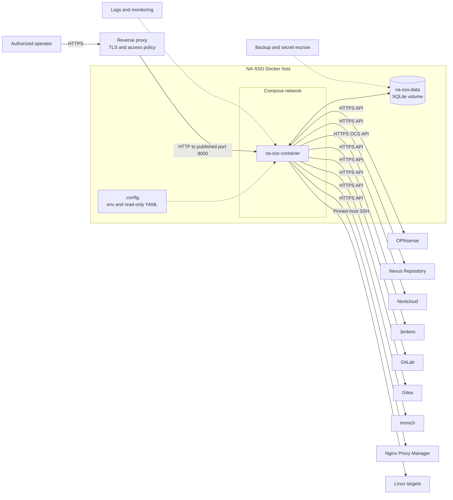

# Build & deployment guide

This is the guide for **deployers**: how to build the image, supply
configuration and secrets, register targets, wire up TLS/ingress, MFA,
notifications, backups, and bring NA-SSO up for real. It covers the normal,
demo-free Compose model in `docker-compose.yaml`. The file is
production-focused, but a production rollout still requires deployment-managed
secrets, immutable image distribution, ingress/TLS, monitoring, backups, and
environment-specific hardening.

Once NA-SSO is running, the other guides take over by audience:

- **[Administrator guide](ADMIN.md)** — running the console: targets, users,
  reconciliation, imports, access reviews, audit, and automation.
- **[User guide](USER.md)** — what to hand an end user: sign-in, password,
  SSH keys, and OpenVPN.
- **[Demo guide](DEMO.md)** — evaluate everything against mock targets first.
- **[Developer guide](DEVELOPER.md)** — internals, synchronization state, and
  local engineering setup.

`compose-helper.sh` is designed for local administration and explicitly is not
a complete production orchestrator. Review its behavior before using it in an
automated or privileged environment.

Configure `ssh_key_policy.default_expiry_days` and `max_expiry_days` to match
device-credential policy. Users may keep separate named keys per device.
Rotation propagates the new key before revoking the selected old key;
individual, emergency, and automatic expiry removal use the normal audited
target synchronization path. Current SSH targets do not report per-key last
use, and the account page labels that limitation explicitly.

`unmanaged_account_policy` bounds read-only enumeration and excludes protected
names, prefixes, and low Unix UIDs. Keep `allow_removal: false` until ownership,
backup, and recovery procedures are tested. When enabled, only Root can approve
removal, and execution still requires a second confirmation plus a one-use
token. Adoption links the remote account without mutation and keeps target
synchronization gated on verified credential handoff.

## Reference architecture

The supplied normal Compose model runs one application process with persistent
SQLite storage. TLS termination, access policy, monitoring, and backup
automation sit outside the repository-provided stack.



The reverse proxy is deliberately outside the supplied Compose stack. The
NA-SSO container runs on its Compose network; SQLite is a mounted volume, not
a separate database container. Each target remains an independent outbound
destination. Managed users continue signing in directly to those targets—NA-SSO
is not in their authentication path.

## Configuration ownership

The normal runtime uses exactly two ignored local files:

| Host file | Container use | Contents |
| --- | --- | --- |
| `.config/.env` | Loaded into `na-sso` | Bootstrap admin, encryption key, database path, and retry timing. |
| `.config/na-sso.yaml` | Mounted read-only at `/config/na-sso.yaml` | Password/SSH policy and non-secret target definitions. |

Create them from the fully annotated templates:

```sh
cp .config/.env.example .config/.env
cp .config/na-sso.yaml.example .config/na-sso.yaml
```

Replace every placeholder before starting. Compose sets
`NA_SSO_CONFIG_FILE=/config/na-sso.yaml`; do not override it in `.config/.env`.

The templates show every supported setting, constraint, and target type.
Management credentials are entered through **Targets**, where they are
encrypted in SQLite and never rendered back.

The password policy's `expires_after_days` value controls managed-account
expiry. Use an integer from 1 through 3650, or `null` to disable expiry. The
calculated date is shown in the administrator's **Users** table and on the
user's **Account** page.

Expired-password acknowledgement is a separate, explicit policy:

- `expiry_acknowledgement_mode: disabled` requires a password change.
- `renewal` keeps the unchanged password for another full
  `expires_after_days` cycle.
- `grace` keeps it only for `expiry_acknowledgement_grace_days`.
- `expiry_acknowledgement_limit` limits acknowledgements for the same password;
  `null` allows repeated acknowledgements. A real password change resets the
  count.

The decision page states the mode, acknowledgement number, and resulting UTC
date before confirmation. Acknowledgement does not rewrite the original
password-change timestamp, and its mode and resulting date are recorded in the
audit trail.

The YAML registry is intended to remain non-secret. Environment-backed YAML
credential fields exist for deployment automation, but UI-managed credentials
are the preferred path for this Compose deployment.

`support_policy` controls the managed-user help path shown when an assigned
target needs operator intervention. Set a short label, safe guidance, and an
optional `https://`, `http://`, or `mailto:` URL. Keep the guidance free of
management endpoints and instruct users never to send passwords or private
keys.

## OPNsense OpenVPN self-service

OpenVPN client-config self-service is configured per OPNsense target in the UI,
not in the YAML registry. Enabling it stores non-secret settings (server,
export template, hostname, certificate lifetime) alongside the target and
verifies them with a non-mutating check. Operational notes:

- The target's management API key needs, in addition to user management, the
  **VPN: OpenVPN: Client Export** privilege plus certificate and revocation-list
  management. Enable verification uses discovery and preset validation only and
  writes no firewall configuration.
- Each user download issues (or reuses) an OPNsense client certificate whose
  common name equals the username and writes the export presets to the
  firewall's `config.xml`, which the firewall records in its own audit log. The
  `.ovpn` — including its private key for certificate targets — is streamed
  once with `no-store` headers and never persisted by NA-SSO.
- Offboarding revokes the certificate by adding it to the certificate
  authority's revocation list, which invalidates already-distributed profiles.
  For the OpenVPN server to enforce this, the CA's CRL must be attached to the
  OpenVPN instance. Deletion is used only as a fallback where the revocation
  list cannot be updated, and that fallback does not invalidate profiles a user
  has already downloaded.

## Bootstrap and recovery settings

| Variable | Purpose |
| --- | --- |
| `NA_SSO_SECRET_KEY` | Signs sessions and encrypts pending secrets and target credentials. Generate a long random value, keep it stable, and back it up. |
| `NA_SSO_ADMIN_USERNAME` | Username created when the database has no administrator. |
| `NA_SSO_ADMIN_BOOTSTRAP_PASSWORD` | Initial password used only for bootstrap; changing it does not rotate an existing account. |
| `NA_SSO_ROOT_RECOVERY_CODE` | Optional long, random emergency second factor accepted only for root and only once per distinct configured value. Remove or rotate it after restoring normal recovery. |
| `NA_SSO_DATABASE_PATH` | SQLite location; `/data/na-sso.db` uses the persistent Compose volume. |
| `NA_SSO_SESSION_COOKIE_SECURE` | Set `true` when browser traffic is exclusively HTTPS so session, feedback, and MFA cookies receive the Secure attribute. Direct local HTTP checks must leave it `false`. |
| `NA_SSO_RETRY_SCAN_SECONDS` | Recovery-worker scan frequency; default `5`. |
| `NA_SSO_RETRY_BASE_SECONDS` | First automatic retry delay; default `5`. |
| `NA_SSO_RETRY_MAX_SECONDS` | Exponential-backoff ceiling; default `300`. |

The protected root recovery account is local-only. It cannot be assigned,
disabled, deleted, demoted, or expired into remote operations.

Use the protected root account to assign one scoped role per delegated account:

| Role | Server-enforced capability |
| --- | --- |
| User operator | Create and manage ordinary users, assignments, and lifecycle actions; cannot change operator accounts or roles. |
| Target operator | Configure write-only target credentials, test connections, and inspect target health. |
| Auditor | Filter, inspect, and export audit events without user or target mutations. |
| Root security administrator | All capabilities, role assignment, and protected local recovery. |

The interface shows only authorised sections, but server-side checks protect
every page, event stream, export, and mutation independently. Role assignments
are audited and invalidate the changed account's existing sessions. Existing
pre-upgrade `admin` accounts migrate to User operator; review and deliberately
reassign any additional capabilities after upgrade. Keep at least one tested
root recovery credential because the root identity cannot be delegated or
removed.

### Administrator MFA

Production examples set `admin_mfa_policy.required: true`. Allowed methods are
`webauthn` and `totp`; restricting the list prevents new enrolment but does not
silently discard an existing factor. WebAuthn requires user verification. Set
`rp_id` to the public hostname and `expected_origin` to its exact HTTPS origin,
including a non-default port. These values must match the browser-visible URL,
especially behind a reverse proxy. TOTP uses standard six-digit, 30-second
codes and rejects replay of an already accepted counter.

The first password-authenticated operator session is confined to MFA setup when
MFA is required and no method exists. Later sign-ins require an enrolled
passkey, TOTP, or a one-use recovery code. Enrolment, revocation, and recovery
replacement require the current password again after
`reauthentication_minutes`. Recovery codes are displayed once, stored only as
keyed hashes, and consumed once. TOTP secrets are encrypted with
`NA_SSO_SECRET_KEY`; WebAuthn stores public credential material and sign counts.
The final factor cannot be revoked while policy requires MFA. Signed-in
operators manage password and MFA controls from **My account**, reached through
the account menu; those personal security controls are intentionally separate
from the capability-aware administrative sidebar.

For root only, `NA_SSO_ROOT_RECOVERY_CODE` provides a separately stored
emergency second factor after the correct root password. Each configured value
works once and creates explicit audit evidence. Rotate or remove it immediately,
then enrol a normal factor and replace recovery codes. Losing
`NA_SSO_SECRET_KEY` also invalidates stored TOTP secrets and recovery hashes, so
back it up with the database as already required.

### Signed webhook notifications

Set `notification_policy.enabled: true` and define one or more endpoints to
deliver subscribed `sync.persistent_failure`, `password.expired`,
`lifecycle.completed`, `approval.completed`, and `access_review.reminder`
events. Production destination URLs must use HTTPS; plain HTTP is accepted only
for localhost development.
Use an exact `${ENV_NAME}` reference for each endpoint `secret`. Runtime root
controls can disable a destination immediately without changing or revealing
that secret, and re-enabling returns disabled queued records to the durable
queue.

Every compact JSON body contains only schema/event/delivery IDs, UTC occurrence
time, event type, actor, subject, operation ID, target ID, and outcome. It never
contains passwords, keys, connector detail, email, target credentials, or HTTP
response bodies. Validate these request headers before processing:

- `X-NA-SSO-Event` and `X-NA-SSO-Delivery` identify the message.
- `X-NA-SSO-Timestamp` is the signing timestamp; reject stale values according
  to the receiving system's replay window.
- `X-NA-SSO-Signature` is `v1=` plus the lowercase HMAC-SHA256 hex digest of
  `<timestamp>.<exact raw body>` using the endpoint secret. Compare in constant
  time and deduplicate on delivery ID.

Non-2xx responses and transport errors retry with capped exponential backoff.
Only the HTTP status or exception class is retained. Exhausted deliveries are
audited and can be manually requeued from **Notifications**; successful
deliveries also create audit evidence. Tune `persistent_failure_attempts`,
`max_attempts`, retry bounds, and scan interval to the receiver's capacity.

### Email notifications

Set `notification_policy.enabled: true` and configure
`notification_policy.email_channel` to deliver human-readable end-user
messages:

- `enabled` turns SMTP delivery on for the configured channel.
- `host` and `port` identify the SMTP server.
- `from_address` supplies the message's From header.
- `tls_mode` is `none`, `starttls`, or `tls`; use `none` only for a trusted
  internal development path, `starttls` for an upgraded connection, and `tls`
  for implicit TLS.
- `username` and `password` provide optional SMTP authentication. Use an exact
  `${ENV_NAME}` reference for `password`; it is write-only and is never
  rendered on **Notifications**.
- `events` selects from the end-user templates for `lifecycle.completed`,
  `password.expired`, and `approval.completed`.

The recipient is resolved from the managed user's email address. If the user
does not exist or has no email address, no message is queued and
`email.skipped_no_recipient` is audited. Email deliveries reuse the same durable
queue, capped retry/backoff, terminal failure, manual retry, and audit machinery
as webhooks; success and exhaustion create `email.delivered` and `email.failed`
evidence. The **Notifications** page identifies the email channel, shows its
recipient in the **Channel**-aware delivery list, and permits failed email
deliveries to be requeued while the configured channel remains enabled.

The signed webhook guarantee above remains unchanged: webhook JSON never
contains passwords, keys, connector detail, email addresses, target
credentials, or response bodies. Email is intentionally different: it sends a
small human-readable subject and body to the user's own configured address, but
still contains no passwords, keys, SMTP credentials, or raw connector detail.

The Users inventory accepts at most 100 accounts per bulk confirmation. Every
bulk assignment, unassignment, disable, or retry has a preview, a durable parent
correlation ID, per-account audit events, partial validation reporting, and an
idempotent confirmation token. Retrying a submitted confirmation does not apply
the action twice.

### Reconciliation, imports, and access policy

Use **Reconciliation** to compare local desired state with read-only target
snapshots before changing anything. Preview runs are bounded and classify each
account as matching, drifted, unknown, or unsupported. Repairs require a
one-use approval; destructive repairs also require an explicit confirmation.
Scheduled reconciliation creates reports only, with retry/backoff controlled by
`reconciliation_policy`; it never repairs automatically.

For larger onboarding or offboarding jobs, use the CSV workflow or the
`/api/v1/bulk/preview` and `/api/v1/bulk/{workflow_id}/execute` endpoints. A job accepts at
most `bulk_import_policy.max_rows` rows, 1,000 by default. The CSV upload cap is
derived from that row cap rather than set independently: it is
`max_rows x bulk_import_policy.row_byte_allowance`, where the allowance defaults
to 2 KiB per row — comfortably above the 455-byte widest row the schema permits,
leaving room for rows that list many targets. Raise `max_rows` only with the
execution cost in mind: rows are processed sequentially, each fanning out to its
own targets, so a job's duration grows with rows x targets per row. Preview validates every row
without mutation, execution is idempotent for the authenticated actor, and the
result preserves per-row failures under one correlated operation. Generated
temporary passwords are available through one audited POST download and are
then erased. CSV exports defend against spreadsheet-formula interpretation.

**Assignment profiles** are immutable, versioned target and membership bundles.
Publish a draft only after its preview, then preview and confirm each application
to users. Applying a profile preserves existing direct target assignments as
explicit exceptions; per-user target and membership include/exclude exceptions
remain visible and override the profile.

Use a user's **Lifecycle policy** to record an owner, reason, effective dates,
temporary access, inactivity handling, and an end action. Temporary access must
have an end date, and scheduled deletion requires explicit confirmation.
Future access remains disabled until its start date. End-date and inactivity
workers disable or open a review as configured; they do not silently grant or
retain access. Access reviews start as drafts, open only on explicit action, and
capture owner/reason snapshots. Reviewer attestations retain, disable, or stage
deletion, with deletion requiring a separate confirmation. Configure bounded
worker timing and reminder delivery under `lifecycle_automation_policy` and
subscribe notification destinations to `access_review.reminder` when needed.

### Versioned automation API

`/api/v1` exposes capability discovery plus bounded user, target-health,
operation, reconciliation, bulk, and audit resources. Browser-session clients
must have completed any required operator MFA; absent or insufficient
authentication returns JSON `401`/`403` errors and never an HTML redirect.

Every response identifies API version `v1` and a request ID. Collections use
`page`, `per_page`, `total`, and `pages` metadata. Control request volume with
`automation_api_policy`; limit responses include `Retry-After`. Mutation
endpoints require an 8–128 character idempotency key and bind its saved response
to the actor, method, path, and request fingerprint. Reusing the key returns the
saved result, while changing the request returns `409`.

Use JSON bulk preview/execution for managed-user changes. Target probe and
reconciliation approval create normal correlated operations visible through
`/api/v1/operations`; reconciliation still requires a saved read-only preview,
one-use approval token, and separate destructive confirmation. API payloads do
not include password hashes, pending credentials, private/public key material,
target management addresses, stored target credentials, or unredacted transport
errors. The interactive OpenAPI document is served at `/docs`.

#### Service accounts and `na-ssoctl`

Root creates service accounts under **Service accounts** and grants only the
Users/Reconciliation, Targets, and/or Operations/Audit capabilities needed by
that automation. Service accounts cannot receive Root security capability and
cannot sign in to the browser. An optional account cutoff disables every token
at once.

Issue a labelled credential with a bounded lifetime, copy its `nas_…` value
from the one-time page into the client's secret manager, and send it as
`Authorization: Bearer <token>`. NA-SSO retains only a keyed hash, prefix,
expiry, issuer, revocation state, and coarsened last-used time. For rotation,
issue the replacement, update and verify the client, then revoke the previous
credential. Revoking the account immediately revokes every credential.

The installed package provides `na-ssoctl`. Prefer a mode-`0600` token file so
the credential does not enter shell history or an exported process environment,
then use the preview/apply split:

```sh
na-ssoctl --base-url https://na-sso.example.lan --token-file /run/secrets/na-sso.token whoami
na-ssoctl --base-url https://na-sso.example.lan --token-file /run/secrets/na-sso.token bulk-preview accounts.csv --idempotency-key onboarding-2026-07-15
na-ssoctl --base-url https://na-sso.example.lan --token-file /run/secrets/na-sso.token bulk-apply <workflow-id> --idempotency-key onboarding-2026-07-15
na-ssoctl --base-url https://na-sso.example.lan --token-file /run/secrets/na-sso.token operation-status <operation-id>
na-ssoctl --base-url https://na-sso.example.lan --token-file /run/secrets/na-sso.token reconcile-preview --target-id cloud --idempotency-key cloud-check-2026-07-15
na-ssoctl --base-url https://na-sso.example.lan --token-file /run/secrets/na-sso.token audit-export --output audit.json --operation <operation-id>
```

The CLI also supports `reconcile-apply`; it requires the saved approval token,
and destructive repair additionally requires `--confirm-destructive`. CSV or
JSON bulk inputs contain the same fields as the web/API import. CLI errors print
only the API error code/message and never the Bearer token.

## Target registry

Every target in `.config/na-sso.yaml` needs a stable unique `id`. IDs are
database identities, not display labels: renaming one retires the old target
history rather than transparently moving it. Repeated target types are allowed.

Keep HTTP target URLs at the server root with no trailing API path. Keep TLS
verification enabled in production. A target's `default_groups` or
`default_roles` must already exist; synchronization fails rather than silently
provisioning an account without the intended memberships.

In **Targets**, save and probe credentials for every enabled target before
assigning users. Until the current credential revision passes, that target
cannot be assigned, synchronized, or retried.

### OPNsense

Create a dedicated local API account with permission to search, create, update,
and delete users through the Auth User API. Generate an API key and secret. The
connector sends `name`, description, email, disabled state, configured group
memberships, and password when required.

Use group identifiers expected by the installed Auth User API version.

### Nexus Repository

Use a dedicated local service account that can read, create, update, and delete
users and change local-user passwords. Relevant privileges include:

- `nexus:users:read`
- `nexus:users:create`
- `nexus:users:update`
- `nexus:users:delete`

Current Nexus source protects the change-password endpoint with `nexus:*`.
Verify the least-privilege role against the exact deployed version. Replace the
example `nx-anonymous` default role with the access intended for managed users.

### Nextcloud

Ensure the OCS Provisioning API app is enabled. Use a dedicated administrator
and preferably an app password. The connector uses Basic authentication and
sends `OCS-APIRequest: true` on every request.

Every configured default group must already exist.

### GitLab

Create an administrator access token on the GitLab Self-Managed instance. The
connector uses the v4 Users and User moderation APIs to read, create, update,
block, unblock, and delete accounts. Managed users require both an email address
and display name.

### Gitea

Create an administrator API token. The connector uses the v1 administrator
Users API to create, edit, prohibit login for, and delete accounts. Managed
users require an email address.

### Immich

Create an API key with the administrator user read, create, update, delete, and
restore permissions. Immich identifies accounts by email; managed users must
therefore have a unique email address. NA-SSO maps disable to Immich's
recoverable soft delete and re-enable to restore; explicit purge uses forced
deletion.

### Nginx Proxy Manager

Use a dedicated administrator email and password that can mint an API token
without a two-factor challenge. The connector targets the v2.15.1 Users API,
identifies managed users by unique lowercase email, maps the NA-SSO username to
NPM nickname, and propagates profile, password, disabled state, discovery, and
soft deletion. NPM exact role/group management and SSH-key lifecycle are
unsupported. NPM accepts managed-user passwords from 8 through 64 characters;
align the NA-SSO password policy maximum accordingly when this target is used.

### Jenkins

Use a dedicated Jenkins administrator username and API token. This target is
limited to Jenkins' built-in local security realm and creates users through the
core administrator account action. Jenkins core does not expose a universal
disable operation across security realms, so unassignment or disable fails
safely instead of deleting the account; explicit user deletion remains
available. External Jenkins realms are outside this connector's scope.

### SSH

Supported platforms are Debian, Ubuntu, RHEL, and Rocky Linux. Pin the exact
SHA-256 host fingerprint and create every configured supplementary group before
probing the target.

The SSH administrator needs the documented user-management commands plus
access to `getent group` and passwordless sudo for `usermod -aG`. NA-SSO
appends configured groups without removing unrelated memberships.

Management authentication supports a password, a private key, or both. Select
**Password + private key** when the SSH server uses an OpenSSH authentication
chain such as `AuthenticationMethods publickey,password`; NA-SSO supplies both
credentials during the same connection attempt.

## Validate, build, and start

Use the helper so the Compose project, file, and env-file behavior remain
consistent:

```sh
# Validate runtime and build-profile services.
./compose-helper.sh --profile build config --quiet

# Build the local image and start detached.
./compose-helper.sh rebuild

# Inspect state and bounded logs.
./compose-helper.sh ps
./compose-helper.sh logs --tail=100 na-sso
curl --fail --silent http://127.0.0.1:8000/healthz
```

Open <http://localhost:8000>, sign in with the bootstrap administrator, and
verify every enabled target before creating users.

`start` and `restart` never rebuild images. Run `build` or `rebuild` after
Dockerfile or application changes.

## Normal operation

1. Check target configuration and probe state under **Targets**.
2. Create or restore an account under **Users**, retain its temporary password,
   and assign only the required targets.
3. Have the user sign in to NA-SSO and replace the temporary password. Until
   then, assigned targets show **CHPW** and remain uncreated or disabled.
4. Review the per-target matrix and the password-expiry date.
5. Inspect failed detail and retry after correcting the target.
6. Review **Audit** for administrative and connector results.

Audit investigations can be filtered by UTC date, actor, subject, target,
action, operation ID, and outcome. CSV and JSON downloads export one bounded
page at a time and are available only to authorised administrators. Configure
`audit_policy.retention_days` in `na-sso.yaml`; expired audit events are pruned
daily while correlated lifecycle operations and per-target attempts remain.
Set the value to `null` only when indefinite retention is intentional, and
account for the resulting database growth. `audit_policy.export_page_size`
controls 25–5000 rows per downloaded page. Exported technical detail is
defensively redacted, but operators must still handle audit files as sensitive.

Initial, administrator-reset, and restore passwords authenticate only to
NA-SSO. They are never propagated. An administrator reset immediately places
the account back into **CHPW** and disables existing assigned target accounts;
the user's replacement password re-enables or creates them. Generated
passwords are displayed once with a copy action and cannot be recovered after
the modal closes.

Unassignment disables the remote account rather than deleting it. Reassignment
either re-enables an existing account or waits in `awaiting credentials` until
a verified password action supplies a credential. It remains in **CHPW** while
a temporary-password decision is outstanding.

Deletion is soft locally. NA-SSO deletes assigned remote accounts, retries
failures, and keeps the completed local record for audit and restoration.
Restore requires a new temporary password and completion of **CHPW** before
target accounts are recreated. Permanent removal requires an explicit purge
after remote deletion completes.

Stop while preserving the database:

```sh
./compose-helper.sh stop
```

Do not use `./compose-helper.sh down` unless deletion of the named database
volume is explicitly intended.

## Security and scaling boundaries

- Plaintext managed-user passwords are never stored. Pending propagation values
  are encrypted and removed after all assigned targets consume them.
- Initial, administrator-reset, and restore passwords remain local-only;
  target accounts stay uncreated or disabled until the user replaces them.
- Target management credentials are encrypted, write-only in the UI, and gated
  by a successful probe.
- Browser-supported SSH enrollment generates private keys client-side. The
  compatibility fallback returns private material once and does not persist it.
- Connector calls use bounded timeouts and pinned SSH host keys.
- The recovery worker assumes one application process. Introduce a distributed
  lock and durable external queue before scaling to multiple workers.
- Put the application behind an authenticated TLS ingress appropriate to the
  environment; the Compose file itself does not terminate TLS.
- Set `NA_SSO_SESSION_COOKIE_SECURE=true` behind that HTTPS ingress. NA-SSO
  rejects cross-site state-changing browser requests using Fetch Metadata plus
  Origin/Referer checks, sets Strict SameSite HttpOnly cookies, denies framing
  and content sniffing, and advertises HSTS on HTTPS responses. Preserve the
  original Host/scheme through the trusted proxy so same-origin checks compare
  against the public origin.

## Backups and recovery

Back up both:

- The `na-sso-data` volume containing SQLite
- The exact `NA_SSO_SECRET_KEY`

Losing or changing the secret key makes encrypted target credentials and any
still-pending propagation secrets unreadable. Test restoration of the volume
and secret together.

Create a transactionally consistent SQLite backup while the single application
process is running, copy it off the Docker host with mode `0600`, and remove the
temporary in-volume copy. Use a deployment-specific encrypted secret store for
`NA_SSO_SECRET_KEY`; never write it into the database archive.

```sh
umask 077
./compose-helper.sh exec -T na-sso python -c 'import sqlite3; source=sqlite3.connect("/data/na-sso.db"); backup=sqlite3.connect("/data/na-sso-backup.db"); source.backup(backup); assert backup.execute("PRAGMA integrity_check").fetchone()[0] == "ok"; backup.close(); source.close()'
./compose-helper.sh cp na-sso:/data/na-sso-backup.db ./na-sso-backup.db
./compose-helper.sh exec -T na-sso rm -f /data/na-sso-backup.db
```

For a local Compose recovery drill, restore the database only while the
application is stopped. The same `.config/.env`—especially the exact secret
key—and YAML registry must accompany it. The one-off ownership and integrity
commands use the same named volume as the stopped service.

```sh
./compose-helper.sh stop
./compose-helper.sh create na-sso
./compose-helper.sh cp ./na-sso-backup.db na-sso:/data/na-sso.db
./compose-helper.sh run --rm --no-deps --user root --entrypoint chown na-sso na_sso:na_sso /data/na-sso.db
./compose-helper.sh run --rm --no-deps --entrypoint python na-sso -c 'import sqlite3; db=sqlite3.connect("/data/na-sso.db"); assert db.execute("PRAGMA integrity_check").fetchone()[0] == "ok"; db.close()'
./compose-helper.sh start
curl --fail --silent http://127.0.0.1:8000/healthz
```

After recovery, sign in and probe every enabled target. Verify that service
accounts, active operations, reconciliation approvals, and encrypted target
credentials are present before resuming mutations. Practice the equivalent
atomic volume-snapshot and secret-restore procedure in the actual deployment
orchestrator; the helper remains a local administration tool.

## Pre-production verification

Use a release artifact that has passed the full automated suite described in
the [developer guide](DEVELOPER.md). Before rollout, verify create and **CHPW**,
normal password change, expiry handling, administrator reset, disable, retry,
delete, and restore against non-production instances matching the deployed
target versions. Confirm TLS, target permissions, memberships, backup
restoration, and ingress access policy in the intended environment.
